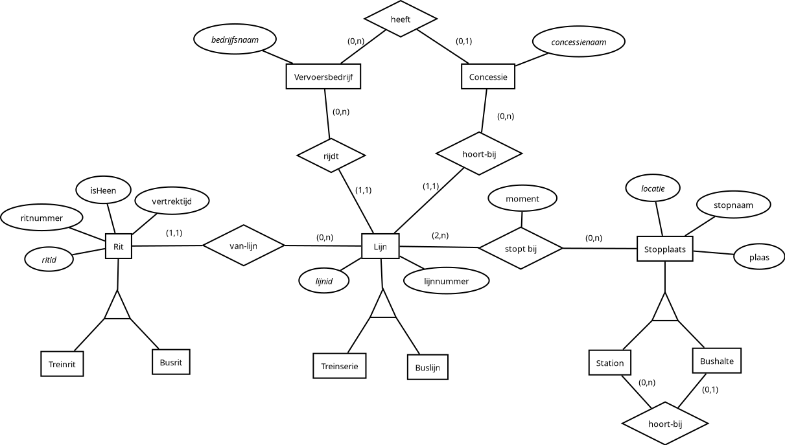

---
lang: nl
documentclass: scrartcl
title: ER-diagram
author:
- Luuk\ Berkers\ (6793592)
- Mirco\ Braams\ (0752169)
...

Nog een paar opmerkingen of het diagram:

- De keys staan schuingedrukt.
- Alle drie de ISA-hiërarchieën zijn 'covering' en 'disjoint'.
- De relaties tussen superentiteiten van de ISA-hiërarchieën kunnen bij de subentiteiten alleen bestaan tussen de overeenkomstige subentiteiten. Bijvoorbeeld de relatie 'stopt-bij' kan dus niet bestaan tussen treinserie en bushalte, maar wel tussen treinserie en station.

